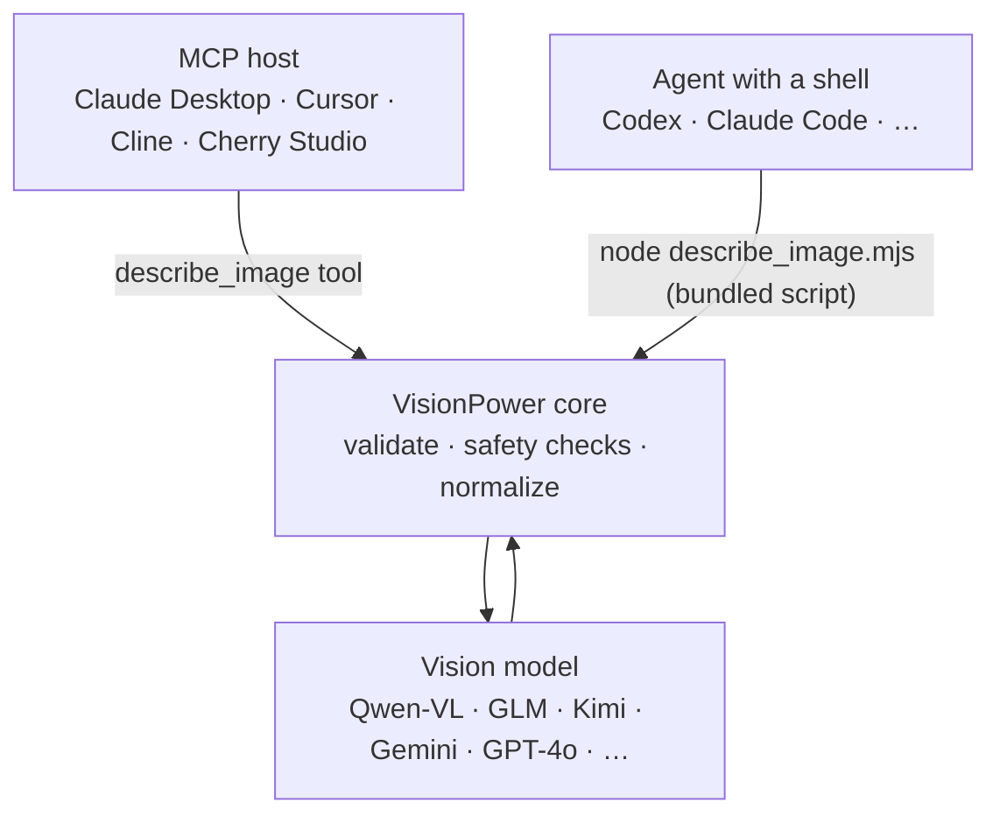

<div align="center">

# 👁️ VisionPower

**Give your AI agent eyes — a lightweight, secure, plug-and-play image-understanding capability, available as both an MCP server and a Skill.**

[](./README.md)
[](https://www.npmjs.com/package/visionpower)
[](./LICENSE)
[](https://nodejs.org)

</div>

VisionPower gives Codex, Claude Desktop, Cursor, Cline, Cherry Studio, and other agents the ability to **understand image content, read screenshot text (OCR), interpret charts, and analyze multiple images in order**.

It is **not tied to any single model**: it defaults to Qwen-VL via Alibaba Cloud Model Studio / DashScope's OpenAI-compatible endpoint, and you can switch to Zhipu GLM, MiniMax, Kimi, Volcengine Doubao, Google Gemini, GPT-4o, or any provider that supports OpenAI `/chat/completions` vision input by configuring the model name and base URL. The same core ships in **two forms** — [MCP](#use-as-an-mcp-server) and [Skill](#use-as-a-skill) — pick either or install both.

---

## ✨ Features

- 🧩 **One capability, two forms** — the same core works as the MCP tool `describe_image` or as a self-contained Skill (one zero-dependency script, download and run).
- 🖼️ **Four input sources** — local `image_path`, public `image_url`, `image_base64`, and an ordered `images[]` array.
- 🎨 **Six image formats** — JPEG / PNG / WEBP / GIF / BMP / TIFF, forwarded as raw bytes; gives an actionable "convert and retry" hint instead of an opaque error when a model rejects a format.
- 🔢 **Ordered multi-image analysis** — auto-labels images as `Image 1 / Image 2 / …` and asks the model to answer in the same order.
- 🔌 **Model-agnostic** — any OpenAI-compatible vision provider; switch by changing two env vars.
- 🔒 **Security first** — path allowlist, file magic-byte verification, private/SSRF guard, strict base64 and input schema validation. See [Security](#-security-by-design).
- 🔁 **Resilient** — automatic retries on upstream throttling / 5xx / network blips (exponential backoff), with a timeout that also covers reading the response body so requests never hang.
- 🪶 **Minimal dependencies** — only the official MCP SDK and zod at runtime; no native modules, no image libraries.
- 🌐 **China-friendly** — built-in npmmirror and local-install paths for unreliable networks.

---

## 🎬 What It Can Do

Hand an image to your agent and let it analyze it:

**Input**

```json
{
  "image_path": "/Users/me/Desktop/dashboard.png",
  "prompt": "Read the key numbers in this screenshot and summarize the trend."
}
```

**Output (example)**

```text
This is a sales dashboard screenshot. The top KPIs show this month's GMV at ¥1,284,500
(+12.3% MoM) and 8,420 orders (+4.1% MoM). The center line chart shows a steady rise over
the last 6 months with a notable dip in March. The pie chart on the right shows East China
as the largest share (38%), followed by South China (25%)...
```

> 📸 Reading screenshots, 🧾 receipt/table extraction, 📊 chart interpretation, 🧭 UI walkthroughs, 🐞 diagnosing error screenshots — any "let the agent take a look" scenario fits.

---

## 🧭 Which Form To Choose

The two forms are **functionally equivalent** — they differ only in how the agent reaches them. Choose by your agent's capabilities:

| Your agent | Pick | Why |
| --- | --- | --- |
| Claude Desktop, Cursor, Cline, Cherry Studio (MCP, maybe no code execution) | **[MCP](#use-as-an-mcp-server)** | Exposes the structured `describe_image` tool with schema-validated, deterministic calls |
| Codex, Claude Code, and other agents **with a shell / code execution** | **[Skill](#use-as-a-skill)** | Runs its own zero-dependency script — no install, no long-running process |
| Pure chat MCP hosts with no code execution | **MCP** | The Skill form has nothing to run its script |

> You can **install both**. For an agent like Codex that has both MCP and a shell, either works.

---

## Use as an MCP server (Strongly Recommended)

> [!IMPORTANT]
> **We strongly recommend running this server as an MCP server**. Compared to the Skill format, MCP is more standardized, stable, and loads flawlessly across all major agent hosts (like Claude Desktop, Cursor, and Cline). You can activate it with a single copy-paste using the configuration block below.

### Requirements
- Node.js 18+
- An API Key for a vision-capable OpenAI-compatible model (e.g. Alibaba Cloud Model Studio, OpenAI API, etc.).

### Option 1: Configure via the WebUI Console

You can easily configure everything (model, API key, base URL, caching, allowed directories, etc.) using the built-in local WebUI configuration console, test image analysis directly using the **Playground**, and copy routing snippets from the **Patch Bay**.

**① Start the WebUI configuration console**
Run the following command in your terminal:
```bash
npx -y --package visionpower@latest visionpower --webui
```
> 💡 This is **the only command you need to remember**: use it for first-time setup, reopening the WebUI later to change your config, and updating to a new release. The `@latest` tag automatically pulls the newest version from npm.

**② Configure and Test**
1. Once running, your browser opens `http://127.0.0.1:17900` automatically (the launch command opens it for you; if it doesn't, visit that address manually).
2. The console has three tabs at the top, covering the full "configure → test → integrate" flow:

> 💡 The console supports **English/Chinese** (toggle top-right) and **dark/light themes**. All screenshots below are the actual UI.
>
> 
>
> **`CONFIG`** — Pick a model preset (18 built-in presets covering China and global endpoints: Qwen3-VL / MiniMax-M3 / GLM-4.6V / Kimi K2.7 Code / Doubao / Gemini / GPT-4o, or Custom), paste your API Key, and optionally tune advanced params (max image bytes, timeout, cache, debug mode). After picking a preset you can still edit the model name to use another model on the same provider. The status badge in the top-right reads `LIVE` once configured. Click **▸ COMMIT CONFIG** to save (or hit **⚡ TEST CONNECTION** first to verify the key).

3. After saving, switch to **`PLAYGROUND`** to verify the model works right away — no need to wire up Claude/Cursor first:

> 
>
> Upload or drop an image (JPG/PNG/WEBP/GIF/BMP/TIFF), type a prompt, click **▸ ANALYZE IMAGE**, and the model's description appears on the right. Above is a real run on a Q3 revenue dashboard.

4. Finally, open **`PATCH BAY`** to generate the MCP config for each host client in one click:

> 
>
> Pick a target host (Claude Desktop / Cursor / Cline), copy the generated JSON snippet, and paste it into that client's config file — **since your API Key already lives in the local config file, the host config is just a single `npx visionpower` line, with no `env` block needed**.

<details>
<summary>🎨 View the light theme</summary>

The console also ships a light theme (toggle `LIGHT`/`DARK` top-right) for users who prefer a bright interface. All features are identical:


</details>

**③ Add to your Host Config (Copy the snippet below)**
Once configured, you only need the **simplest configuration** in your MCP client (such as Claude Desktop or Cursor). There is no need for a complex `env` block. Please copy and paste this block directly:

```json
{
  "mcpServers": {
    "visionpower": {
      "command": "npx",
      "args": ["-y", "--package", "visionpower@latest", "visionpower"],
      "timeoutMs": 120000
    }
  }
}
```

* **Codex (TOML)**, add this to `~/.codex/config.toml`:
```toml
[mcp_servers."visionpower"]
type = "stdio"
command = "npx"
args = ["-y", "--package", "visionpower@latest", "visionpower"]
```

* **Form-based clients** (e.g. Cline, Cherry Studio, and other UIs with separate fields), fill in each field as follows:

| Field | Value |
| --- | --- |
| Name | `visionpower` |
| Type | `stdio` |
| Command | `npx -y --package visionpower@latest visionpower` |
| Env | *(leave empty)* |

> **Note**: The host reads config **at startup**, so you must **restart** the host application after configuration changes.
>
> **About `timeoutMs`**: The first `npx` run downloads VisionPower, and vision-model inference is inherently slower than plain text, so some hosts' default timeouts (e.g. 30–60s) are easily hit on first launch or with large images. Setting `120000` (2 minutes) leaves comfortable headroom; raise it further if you still see timeouts. Note that `timeoutMs` is a **host-layer** (MCP client) wait limit, distinct from the provider-side `VISIONPOWER_TIMEOUT_MS` (default 60s) — adjust each as needed.

---

### Option 2: Let Your Agent Install & Configure It

If you are chatting with an AI assistant that has file-writing capabilities (such as Claude Code, Cursor, or Cline), you can simply copy and send the prompt below to it. It will automatically write your local configuration file and register the MCP server:

```text
Please help me configure and register the VisionPower MCP service.

Vision Model API Key: [Paste your API key here]
Default Model: qwen3-vl-flash

[Steps]
1. Check the environment: run `node --version` and confirm the version is >= 18. If Node.js is not installed or the version is too old, tell me to install Node.js 18+ first (https://nodejs.org) and stop here until I confirm.

2. Smoke test: run the following command to confirm npx can pull and execute VisionPower:
   npx -y --package visionpower@latest visionpower --version
   If it errors, show me the error and stop here.

3. Write the local config file: create `~/.visionpower/config.json` with the following content (do not print my full API key in plaintext in the chat output):
   {
     "apiKey": "[Paste your API key here]",
     "model": "qwen3-vl-flash"
   }

4. Register the MCP server: find my current host's MCP config file (e.g. for Claude Desktop or Cursor), use its existing mcpServers structure as a template, and add the visionpower entry:
   "visionpower": {
     "command": "npx",
     "args": ["-y", "--package", "visionpower@latest", "visionpower"]
   }

5. Once done, show me the paths of all files you modified and remind me to restart the host application for the changes to take effect.
```

---

## Use as a Skill

The Skill form is a **self-contained, zero-install, zero-dependency** folder, [`VisionPower-Skill/`](./VisionPower-Skill): it holds `SKILL.md` and a script `describe_image.mjs` that runs with plain Node. **No CLI to install, no `npm install`** — download this one folder and it works; all it needs is Node 18+ and an API key. Ideal for agents **with code execution** such as Codex and Claude Code.

> The folder is named `VisionPower-Skill` (easy to recognize on download), but the skill itself is named `visionpower` (see `name:` in `SKILL.md`). So install it to `~/.claude/skills/visionpower/` to keep the install directory name and the skill name aligned.

### Fastest path: let your agent install it

Send the prompt below to your agent. It will install the Skill, then **ask you which model to use and save your API key to a persistent config file**:

```text
Please install the VisionPower Skill for me.

1. Get the VisionPower-Skill folder from https://github.com/RunhuaHuang/VisionPower
   (git clone the repo, or download just that folder). It is self-contained; no npm install.

2. Install its contents as a skill named visionpower (Claude Code example):
   mkdir -p ~/.claude/skills/visionpower
   cp VisionPower-Skill/SKILL.md VisionPower-Skill/describe_image.mjs ~/.claude/skills/visionpower/

3. Confirm Node 18+ (node --version), then verify with
   node ~/.claude/skills/visionpower/describe_image.mjs --help

4. Then ask me which vision model to use (default qwen3-vl-flash; also qwen3-vl-plus or gpt-4o),
   ask me for my API key, and save it to the persistent config file ~/.visionpower/config.json
   (mode 600), shaped {"apiKey":"...","model":"..."} (for OpenAI add "baseUrl":"https://api.openai.com/v1").
   Do not echo the full key back to me.

5. Finally, confirm the Skill works with a sample image. On success the script automatically
   writes ~/.visionpower/skill-state.json (configVerified=true); future calls should run the
   script directly without repeating config checks. Only guide me through setup again if the
   script reports a missing-key/auth/config error.
```

### Manual install

1. Install the skill contents as a skill named `visionpower` (Claude Code personal example):

   ```bash
   mkdir -p ~/.claude/skills/visionpower
   cp VisionPower-Skill/SKILL.md VisionPower-Skill/describe_image.mjs ~/.claude/skills/visionpower/
   ```

   Project-level: place them at `<your-project>/.claude/skills/visionpower/`. For other agents, drop them into their skills directory — even without an auto-loading mechanism you can simply tell the agent to "read this SKILL.md and run describe_image.mjs as described".

2. Confirm Node 18+ and save the API key to a **persistent config file** (read automatically on every run — configure once, works forever):

   ```bash
   node --version            # needs v18+
   mkdir -p ~/.visionpower
   cat > ~/.visionpower/config.json <<'JSON'
   { "apiKey": "your-api-key", "model": "qwen3-vl-flash" }
   JSON
   chmod 600 ~/.visionpower/config.json
   ```

   > Why a config file instead of `export VISIONPOWER_API_KEY=...`? An agent's spawned shell usually does **not** read the env vars you put in `~/.zshrc`, which is why "I configured it but it asks every time" happens. The config file is independent of the shell, so it just works. Env vars still work and override the file. `SKILL.md` has a "first-time setup" flow: if the key is missing when the skill triggers, the agent guides you through choosing a model and writing this file; after a successful call, the script also writes `~/.visionpower/skill-state.json` as a verified-state switch so later calls skip config preflight unless a call fails.

### Use it

Then just tell your agent "read the text in this screenshot" with the image's **absolute path**; it will trigger the skill and run (`<skill>` is the skill folder's absolute path):

```bash
node <skill>/describe_image.mjs --image-path /absolute/path/to/image.png --prompt "Read the text and summarize."
```

Full script usage is in [Interface Reference · Skill script](#skill-script).

---

## 🧩 How It Works



Both forms share the same core logic (`src/vision-core.js` + `src/config.js`): the MCP server imports it directly, while the Skill's `describe_image.mjs` is **auto-bundled** from the same core by `npm run build:skill` into a single zero-dependency script (a test verifies the two never drift). The core just does "validate + normalize + forward" — it never caches images and never fetches `image_url` itself (the upstream model does).

---

## 🧰 Interface Reference

### `describe_image` (MCP tool / CLI JSON request)

| Parameter | Type | Description |
| --- | --- | --- |
| `image_path` | string | **Absolute path** to a local image file. |
| `image_url` | string | **Publicly reachable** `http`/`https` image URL. |
| `image_base64` | string | Standard base64 **without** a `data:` prefix. |
| `image_mime_type` | enum | `image/jpeg`, `image/png`, `image/webp`, `image/gif`, `image/bmp`, `image/tiff`; only with `image_base64`. Auto-detected from bytes if omitted. |
| `images` | array | Ordered array of images, each item a combination of the four fields above. **Do not combine with the top-level single-image fields.** |
| `prompt` | string | A specific question or instruction; leave empty for a full description. |

> Provide exactly one of `image_path` / `image_url` / `image_base64` (one per item for multi-image calls).

> **Image format support is model-dependent**: VisionPower verifies the real format of local/Base64 images and forwards the original bytes **without transcoding**. For example, Qwen3-VL can receive TIFF directly, while a model that rejects TIFF/BMP produces an actionable error suggesting another vision model or an external PNG/JPEG conversion. Multi-page TIFF handling is also provider-dependent; when every page must be analyzed, export the pages as separate images and submit them with `images[]`.

<details open>
<summary><b>Examples: local / URL / Base64 / multiple</b></summary>

```json
{ "image_path": "/absolute/path/to/image.png", "prompt": "Read the text in this screenshot and summarize it." }
```

```json
{ "image_url": "https://example.com/image.png", "prompt": "What is in this image?" }
```

```json
{ "image_base64": "...", "image_mime_type": "image/png", "prompt": "Extract all visible text." }
```

```json
{
  "images": [
    { "image_path": "/absolute/path/to/first.png" },
    { "image_url": "https://example.com/second.jpg" }
  ],
  "prompt": "Read and summarize the text in each image in order."
}
```

For multi-image calls, VisionPower labels images as `Image 1`, `Image 2`, … and asks the model to answer in the same order, section by section.

</details>

### Skill script

The Skill form uses its bundled `describe_image.mjs` (`<skill>` is the skill folder's absolute path):

```text
node <skill>/describe_image.mjs --image-path <absolute path> [--prompt <text>]
node <skill>/describe_image.mjs --image-url <https url> [--prompt <text>]
node <skill>/describe_image.mjs request.json        # pass a JSON request file
echo '<json request>' | node <skill>/describe_image.mjs   # or via stdin
```

| Option | Description |
| --- | --- |
| `--image-path <p>` | Absolute path to a local image |
| `--image-url <u>` | Public http(s) image URL |
| `--image-base64 <b>` | Base64 data (for large data prefer a JSON file or stdin) |
| `--mime <type>` | MIME type for `--image-base64` |
| `--prompt <text>` | Question or instruction (optional) |
| `--input <file>` or a positional arg | Read a JSON request (same shape as `describe_image` above) from a file |
| `--help` | Show help |

When no source flag is given, the script reads a **JSON request from stdin** (the same shape as the MCP tool, including `images[]`). The result is printed to stdout; on failure it prints `VisionPower error: <reason>` to stderr and exits non-zero.

---

## 🤖 Supported Models

Any provider that supports OpenAI's `/chat/completions` vision input format works. Switch by changing `VISIONPOWER_MODEL` and `VISIONPOWER_BASE_URL` (most presets in the tables below are also built into the WebUI **CONFIG** tab dropdown).

> Model IDs change as vendors release new versions; the table lists current mainstream ones. If an ID is retired, check the provider's console for the latest name — the base URL is generally stable.

**China endpoints (CN)**

| Provider | `VISIONPOWER_MODEL` | `VISIONPOWER_BASE_URL` | Notes |
| --- | --- | --- | --- |
| Alibaba Cloud Model Studio / DashScope | `qwen3-vl-flash` | `https://dashscope.aliyuncs.com/compatible-mode/v1` | **Default.** Fast and cost-effective. |
| Alibaba Cloud Model Studio / DashScope | `qwen3-vl-plus` | same | Higher-quality Qwen-VL, subject to account access. |
| Alibaba Cloud Model Studio / DashScope | `qwen3.6-flash` | same | Use if this multimodal model is available in your account. |
| Zhipu BigModel | `glm-4.6v` | `https://open.bigmodel.cn/api/paas/v4` | Zhipu vision flagship; global endpoint `https://api.z.ai/api/paas/v4`. |
| Zhipu BigModel | `glm-5v-turbo` | `https://open.bigmodel.cn/api/paas/v4` | Zhipu's first multimodal coding model; global endpoint `https://api.z.ai/api/paas/v4`. |
| Volcengine Ark (Doubao) | `doubao-seed-2-1-turbo-260628` | `https://ark.cn-beijing.volces.com/api/v3` | Latest Doubao multimodal version. ¹ |
| Volcengine Ark (Doubao) | `doubao-seed-2-0-lite-260428` | `https://ark.cn-beijing.volces.com/api/v3` | Lightweight, cost-effective. ¹ |
| MiniMax (China) | `minimax-m3` | `https://api.minimaxi.com/v1` | Global endpoint is `api.minimax.io`; CN/global accounts are separate and keys are not interchangeable. |
| Moonshot (Kimi) | `kimi-k2.6` | `https://api.moonshot.cn/v1` | Native multimodal + vision; older K2 series is retired, use K2.6. |
| Moonshot (Kimi) | `kimi-k2.7-code` | `https://api.moonshot.cn/v1` | Agentic coding model, 256K context. |

**Global endpoints**

| Provider | `VISIONPOWER_MODEL` | `VISIONPOWER_BASE_URL` | Notes |
| --- | --- | --- | --- |
| Google Gemini | `gemini-3.6-flash` | `https://generativelanguage.googleapis.com/v1beta/openai` | Native OpenAI-compatible endpoint; `image_url` supported. |
| OpenAI | `gpt-4o` | `https://api.openai.com/v1` | Strong general image understanding. |
| OpenAI | `gpt-4o-mini` | `https://api.openai.com/v1` | Lower-cost OpenAI option. |
| MiniMax (Global) | `minimax-m3` | `https://api.minimax.io/v1` | Global domain is `.io` (China is `minimaxi.com`). |
| Moonshot (Kimi Global) | `kimi-k2.6` | `https://api.moonshot.ai/v1` | Global endpoint uses the `.ai` domain. |
| Moonshot (Kimi Global) | `kimi-k2.7-code` | `https://api.moonshot.ai/v1` | Same, coding model global endpoint. |
| Other OpenAI-compatible | provider model ID | provider `/v1` base URL | Replace both fields with your provider's config. |

> **Footnotes**
> ¹ **Volcengine Ark / Doubao**: Ark supports two calling styles — use the **Model ID** directly from the table above (recommended; an `ark-`-prefixed API Key is all you need), or use an "endpoint ID" (shaped like `ep-2024xxxxxx-xxxxx`) created in the [Ark console](https://www.volcengine.com/product/ark) by setting `VISIONPOWER_MODEL` to that `ep-`-prefixed ID. The Model ID approach works out of the box — no endpoint creation required.
> ² **Anthropic Claude**: Claude's native API uses the Anthropic protocol (`/v1/messages`) and is **not directly compatible** with OpenAI's `/chat/completions`, so you cannot point VisionPower straight at `api.anthropic.com`. To use Claude, put an OpenAI↔Anthropic adapter in between (e.g. [LiteLLM](https://github.com/BerriAI/litellm), [OpenRouter](https://openrouter.ai)) and set `VISIONPOWER_BASE_URL` to that adapter.

<details>
<summary><b>OpenAI example (MCP env)</b></summary>

```json
"env": {
  "VISIONPOWER_API_KEY": "your-api-key",
  "VISIONPOWER_MODEL": "gpt-4o",
  "VISIONPOWER_BASE_URL": "https://api.openai.com/v1"
}
```

</details>

---

## ⚙️ Configuration (env vars / config file)

Both forms share the same configuration. Precedence: **env var > config file > default**.

**Config file**: `~/.visionpower/config.json` (override the path with `VISIONPOWER_CONFIG`). This is the recommended way for the Skill — an agent's spawned shell usually does **not** inherit env vars you exported in your shell profile, whereas the config file is read automatically on every run (configure once, works forever). Use keys `apiKey` / `model` / `baseUrl` / `maxImages` / `timeoutMs`:

```json
{
  "apiKey": "your-api-key",
  "model": "qwen3-vl-flash"
}
```

**Environment variables** (override the config file):

| Name | Required | Default | Description |
| --- | --- | --- | --- |
| `VISIONPOWER_API_KEY` | ✅ | | API key for the configured vision provider. |
| `VISIONPOWER_MODEL` | | `qwen3-vl-flash` | Vision model name. |
| `VISIONPOWER_BASE_URL` | | `https://dashscope.aliyuncs.com/compatible-mode/v1` | OpenAI-compatible base URL **without** `/chat/completions`. |
| `VISIONPOWER_ALLOWED_DIRS` | | (empty = unrestricted) | Comma-separated allowlist of directories that `image_path` must fall inside. |
| `VISIONPOWER_MAX_IMAGE_BYTES` | | `20971520` (20MB) | Max size per local/Base64 image, in bytes. |
| `VISIONPOWER_TIMEOUT_MS` | | `60000` | Upstream API timeout (ms). |
| `VISIONPOWER_MAX_TOKENS` | | `2048` | Max response tokens. |
| `VISIONPOWER_MAX_IMAGES` | | `8` | Max images per call. |
| `VISIONPOWER_MAX_RETRIES` | | `2` | Automatic retries on upstream 429/5xx or network errors (exponential backoff + jitter). |
| `VISIONPOWER_DEBUG` | | `false` | When `true`, logs the request model, image count, and timing to stderr. |
| `VISIONPOWER_CACHE` | | `true` | Enable the **in-process result cache**: byte-identical local/Base64 image + prompt requests in the same session reuse the previous answer. Public URLs are mutable and are never cached. Set to `false` to disable. |
| `VISIONPOWER_CACHE_MAX_ENTRIES` | | `32` | Max entries kept in the result cache; `0` disables it. |
| `VISIONPOWER_CACHE_TTL_MS` | | `1800000` (30 min) | Per-entry cache lifetime in ms; after it elapses, a repeated request calls the model again. |
| `VISIONPOWER_SKILL_STATE` | | `~/.visionpower/skill-state.json` | Skill script only: records whether setup has been verified so later calls can skip repeated preflight checks. |

> **Naming**: the primary prefix is `VISIONPOWER_*`. The API key also falls back to `OPENAI_API_KEY`.

### Migration (0.x → 1.x)

- The old README used `RUN_VISION_API_KEY`; the 1.x primary name is `VISIONPOWER_API_KEY`. Rename `RUN_VISION_API_KEY` to `VISIONPOWER_API_KEY` in your MCP config or shell environment.
- Prefer replacing `npx -y visionpower` directly with `npx -y --package visionpower@latest visionpower`, which prevents `npx` from using an old project-local `node_modules/.bin/visionpower` first.
- Mainland China mirror command: `npx -y --registry=https://registry.npmmirror.com --package visionpower@latest visionpower`.

---

## 🔒 Security by Design

VisionPower validates images through several layers before handing them to the model, making it suitable for agents that can read local files:

- **Path allowlist** — with `VISIONPOWER_ALLOWED_DIRS` set, `image_path` must resolve inside an allowed directory; symlinks are resolved via `realpath` first to prevent escape.
- **Absolute path enforced** — relative paths are rejected to avoid ambiguity.
- **Magic-byte verification** — local images are checked so the file's real bytes match its extension; a mismatch is rejected.
- **Strict base64 validation** — rejects `data:` prefixes, invalid characters, and bad padding, with a re-encode consistency check.
- **Private / SSRF guard** — `image_url` blocks `localhost`, private/reserved IPv4 ranges, IPv6 unique-local/link-local, and IPv4-mapped IPv6, and rejects URLs carrying credentials.
- **Size & count limits** — per-image bytes, images per call, output tokens, and request timeout are all configurable and enforced.
- **Strict input schema** — zod-based validation; unknown fields and conflicting field combinations are explicitly rejected.

---

## 🧪 Local Development

```bash
npm install
npm test            # unit tests (config parsing + image normalization + safety + skill-sync check)
npm run smoke       # end-to-end: boot the MCP server + confirm the skill script rejects an empty request
npm run build:skill # after changing the core, regenerate VisionPower-Skill/describe_image.mjs
npm start           # start the MCP server directly over stdio
```

Source layout: `src/vision-core.js` (core logic), `src/config.js` (config), `src/schema.js` (MCP input schema), `src/index.js` (MCP front-end). The Skill front-end `VisionPower-Skill/describe_image.mjs` is auto-generated from the core by `scripts/build-skill.mjs` (kept in sync by `npm test`).

---

## ❓ FAQ

<details>
<summary><b>What's the difference between MCP and Skill? Which one should I install?</b></summary>

They are functionally equivalent and differ only in how they connect: MCP exposes a structured tool, works across MCP hosts, and runs even in pure chat hosts with no code execution; the Skill is "instructions + a self-contained, zero-dependency script" and needs an agent with a shell / code execution (e.g. Codex, Claude Code). See [Which form to choose](#-which-form-to-choose). You can install both.

</details>

<details>
<summary><b>The skill triggered but the script won't run?</b></summary>

Make sure Node 18+ is installed (`node --version`) and call the script by its **absolute path** (e.g. `node ~/.claude/skills/visionpower/describe_image.mjs --help`). If it reports "API key not configured", follow the "first-time setup" in `SKILL.md` to write the key into `~/.visionpower/config.json`. If you "exported the env var but it still isn't recognized", the agent's spawned shell likely didn't inherit it — use the config file instead.

</details>

<details>
<summary><b>First launch is slow / occasionally fails?</b></summary>

The first `npx` run downloads VisionPower; afterwards it usually uses the local cache. For unreliable networks or long-term use, prefer a global install.

</details>

<details>
<summary><b>Says the model is unavailable / image_path is not allowed?</b></summary>

Model availability depends on your provider account, region, and permissions — switch to a model your account can access. An `image_path` error usually means you set `VISIONPOWER_ALLOWED_DIRS` and the image is outside the allowlist, or the path is not absolute.

</details>

---

## 📄 License

[MIT](./LICENSE) © Runhua

<div align="center">
<sub>If VisionPower helped you, consider leaving a ⭐ Star.</sub>
</div>
